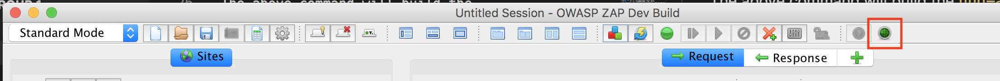

# Installing the HUD
The HUD can be developed on:

  * Linux
  * Windows 10
  * Mac OSX 

### Dependencies
You will need to have the following tools installed for development of the HUD.

  * `gradle`

### Development
To develop with the HUD you will need to clone the following two repositorites.

**NOTE:** It is recommended that both repositories are sibling directories and maintain the original repository names.

  * [https://github.com/zaproxy/zaproxy](https://github.com/zaproxy/zaproxy)
  * [https://github.com/psiinon/zap-hud](https://github.com/psiinon/zap-hud)

#### Build the HUD
To build a development version of the HUD plugin run the following command.

`gradle deployAndResetHud`

The above command will build the `hud-alpha-1.zap` plugin to the `zap-hud/build/zap/` directory and move the compiled plugin to the `zaproxy/src/plugin` project subdirectory.

#### Adding the HUD plugin to ZAP
To add the HUD plugin to ZAP, go to `File->Load Add-on File...` and browse to the `zaproxy/src/plugin` directory and select the `hud-alpha-1.zap` extension.

After that you should see the ZAP HUD beacon in the ZAP icon tray. 

