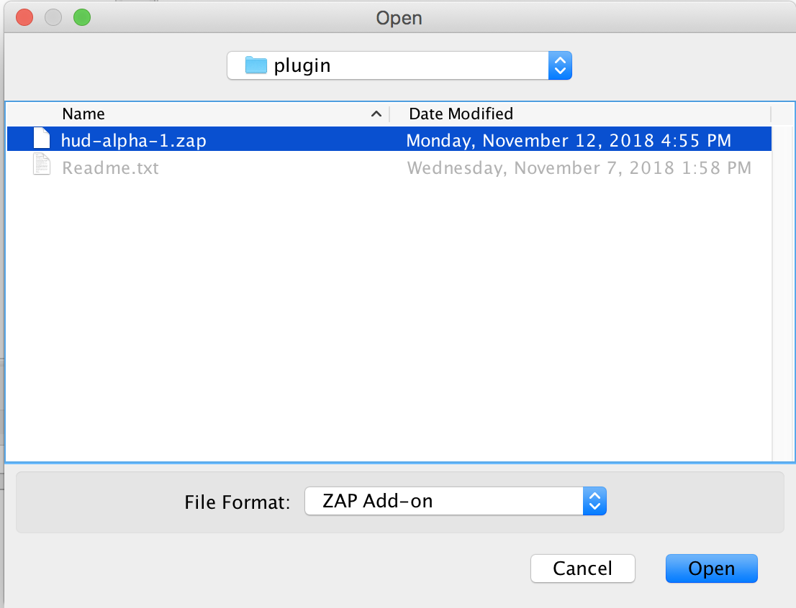

# Developing the HUD

The HUD can be developed on:

- Linux
- Windows 10
- Mac OSX

## Dependencies

ZAP requires Java 8 or higher

- [gradle](https://gradle.org/install/) is required for development with the HUD.

## Installing

Clone the repo using:

`git clone https://github.com/zaproxy/zap-hud.git`

## Run ZAP with the HUD

This is the easiest way to manually test the HUD if you have made any changes.

cd into the `zap-hud` directory and run ZAP on Linux or MacOS with the HUD using:

`./gradlew runZap`

Windows is not currently supported but will be soon.

## Run Tests

### Unit Tests

`./gradlew test`

### Selenium Regression Tests

`./gradlew zapRunTests`

## Out of date instructions?

Install `npm` from the [Node.js site.](https://docs.npmjs.com/getting-started/installing-node#installing-npm-from-the-nodejs-site)

After installing run `npm install` in the `zap-hud` directory to install the HUD dependences.

**Building**

The HUD uses `webpack` as its _static module bundler_ to transpile Vue & javascript files.

Run webpack with:
`npm run build`

The HUD uses Gradle as its Java build tool.

Run the following command from the root directory:
`gradle deploy`

**Testing**

The HUD uses `ava` as its testing framework.

Run all tests with:

`npm run test` or `gradle npmTestHud`

Tests are found in the `src/test/js` directory.

**Linting**

The HUD uses `xo` as its linter.

Run the linter with:

`npm run lint` or `gradle npmLintAllHud`

If you want to lint just the staged changes use:

`npm run lint-staged` or `gradle npmLintStagedHud`

// Need to verify if the instructions below are still up to date

## Development

To develop with the HUD you will need to clone the following two repositorites.

**NOTE:** It is recommended that both repositories are sibling directories and maintain the original repository names.

- [https://github.com/zaproxy/zaproxy](https://github.com/zaproxy/zaproxy)
- [https://github.com/psiinon/zap-hud](https://github.com/psiinon/zap-hud)

#### Build the HUD

To build a development version of the HUD plugin run the following command.

`gradle deployAndResetHud`

The above command will build the `hud-alpha-1.zap` plugin to the `zap-hud/build/zap/` directory and move the compiled plugin to the `zaproxy/src/plugin` project subdirectory.

#### Adding the HUD plugin to ZAP

To add the HUD plugin to ZAP, go to `File->Load Add-on File...` and browse to the `zaproxy/src/plugin` directory and select the `hud-alpha-1.zap` extension.

After that you should see the ZAP HUD beacon in the ZAP chrome toolbar and the Installed Plugins view.

